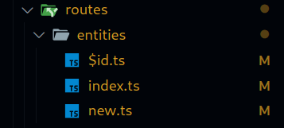
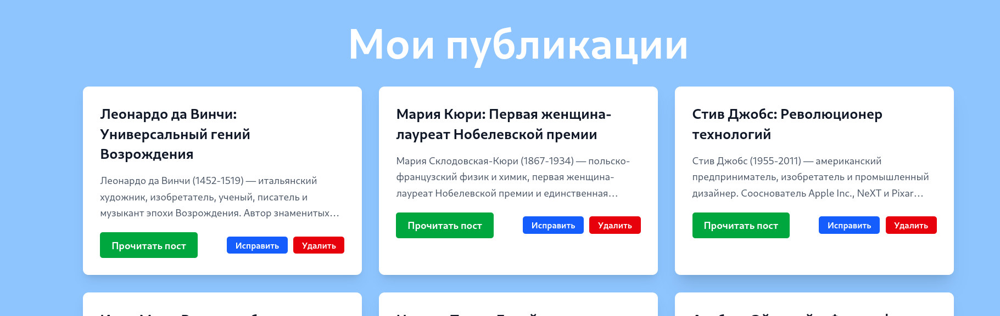
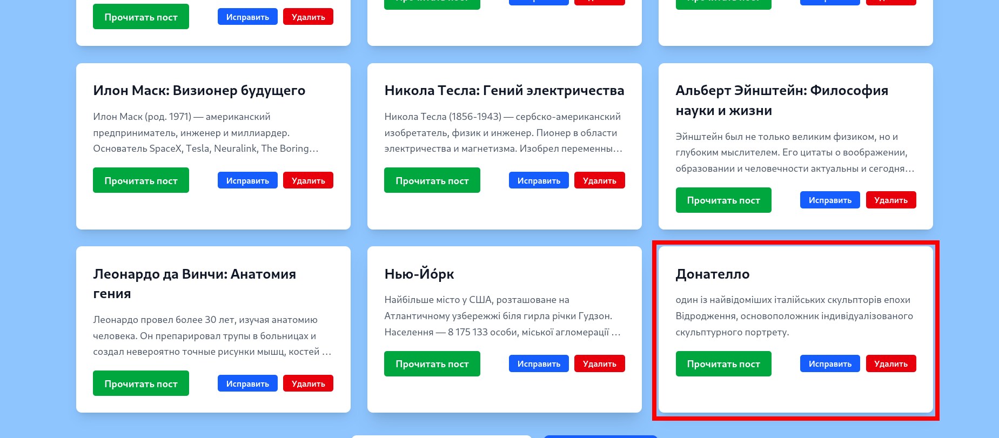

# Практично-лабораторне заняття №6

## Розробка UI для реалізації CRUD-операцій

### Мета

Створити користувацький інтерфейс для взаємодії з реалізованим RESTful API, що надає можливість перегляду, створення, редагування та видалення екземплярів певної сутності. Розробка ведеться на базі React з використанням TanStack Router для реалізації маршрутизації.

### Завдання

#### 1.Сторінка колекції екземплярів сутності (/posts)

#### 2.Сторінка окремого екземпляра сутності (/posts/:id або /posts/new)

### Виконання Завдання:

Запускамо проэкт командою

```bash
npm run dev
```


Бачимо що проект запустився


### Створив 2 директорії: **EntityCard** та **Modal** та створив в серединіних відповідні файли tsx та ts


Вмість файлів:

### EntityCard.tsx

```typescript
import type { Entity } from "../../../types/Entity";

interface Props {
  entity: Entity;
  onEdit: () => void;
  onDelete: () => void;
  onDetails: () => void;
}

export default function EntityCard({
  entity,
  onEdit,
  onDelete,
  onDetails,
}: Props): JSX.Element {
  return (
    <div className="bg-white rounded-lg shadow-lg p-6 hover:shadow-xl transition-shadow duration-200">
      {/* Заголовок */}
      <h2 className="text-xl font-bold text-gray-900 mb-3">{entity.title}</h2>

      {/* Описание */}
      <p className="text-gray-600 text-sm leading-relaxed mb-4 line-clamp-3">
        {entity.content}
      </p>

      {/* Действия */}
      <div className="flex justify-between items-center">
        <button
          onClick={onDetails}
          className="text-blue-600 hover:text-blue-800 underline text-sm font-medium"
        >
          Подробнее
        </button>

        <div className="flex gap-2">
          {/* Кнопка исправления */}
          <button
            onClick={onEdit}
            className="bg-blue-600 text-white px-3 py-1 rounded text-xs font-bold hover:bg-blue-700 transition-colors duration-200"
          >
            Исправить
          </button>

          {/* Кнопка удаления */}
          <button
            onClick={onDelete}
            className="bg-red-600 text-white px-3 py-1 rounded text-xs font-bold hover:bg-red-700 transition-colors duration-200"
          >
            Удалить
          </button>
        </div>
      </div>
    </div>
  );
}
```

### index.ts (EntityCard):

```typescript
export { default } from "./EntityCard";
```

### Modal.tsx

```typescript
interface Props {
  headerMessage: string;
  bodyMessage: string;
  show: boolean;
  onConfirm?: React.MouseEventHandler<HTMLButtonElement>;
  onCancel?: React.MouseEventHandler<HTMLButtonElement>;
}

export default function Modal({
  headerMessage,
  bodyMessage,
  show,
  onConfirm,
  onCancel,
}: Props): JSX.Element {
  return (
    <div
      className={`${
        show
          ? "opacity-100 pointer-events-auto"
          : "opacity-0 pointer-events-none"
      } fixed inset-0 bg-black bg-opacity-50 flex items-center justify-center transition-transform duration-300 ease-in-out`}
    >
      <div className="bg-white p-8 rounded-lg shadow-lg max-w-sm w-full transform transition-transform duration-300 ease-in-out">
        <h2 className="text-xl font-semibold text-gray-900 mb-4">
          {headerMessage}
        </h2>
        <p className="text-gray-700 mb-6">{bodyMessage}</p>
        <div className="flex justify-end gap-4">
          <button
            className="bg-gray-500 text-white px-5 py-2 rounded-lg hover:bg-gray-600 transition-all duration-200 ease-in-out focus:outline-none"
            onClick={onCancel}
          >
            Отмена
          </button>
          <button
            className="bg-red-600 text-white px-5 py-2 rounded-lg hover:bg-red-700 transition-all duration-200 ease-in-out focus:outline-none"
            onClick={onConfirm}
          >
            Подтвердить
          </button>
        </div>
      </div>
    </div>
  );
}
```

### index.ts(Modal)

```typescript
export { default } from "./Modal";
```

### Створемо файли **Entities.tsx** , **EntityCreate.tsx** , **EntityDetails.tsx** у директорії **src/components/pages**


Вміст файлів:

### Entities.tsx

```tsx
import { useState, useEffect } from "react";
import { useNavigate } from "@tanstack/react-router";

import { getAllEntities, deleteEntity, updateEntity } from "../entities";
import type { Entity } from "../types/Entity";
import EntityCard from "../components/ui/EntityCard";
import Modal from "../components/ui/Modal";

export default function Entities(): JSX.Element {
  const navigate = useNavigate();

  const [entities, setEntities] = useState<Entity[]>([]);
  const [showModal, setShowModal] = useState(false);
  const [selectedId, setSelectedId] = useState<number | null>(null);

  useEffect(() => {
    setEntities(getAllEntities());
  }, []);

  // --- Удаление ---
  const handleDelete = (id: number) => {
    setSelectedId(id);
    setShowModal(true);
  };

  const confirmDelete = () => {
    if (selectedId !== null) {
      deleteEntity(selectedId);
      setEntities(entities.filter((e) => e.id !== selectedId));
      alert("Удалено!");
    }
    setShowModal(false);
  };

  // --- Редактирование ---
  const handleEdit = (entity: Entity) => {
    const title = prompt("Новое название:", entity.title);
    if (!title || title.trim().length < 3)
      return alert("Слишком короткое название.");

    const content = prompt("Новое описание:", entity.content);
    if (!content || content.trim().length < 10)
      return alert("Слишком короткое описание.");

    const updated = updateEntity(entity.id, {
      title: title.trim(),
      content: content.trim(),
    });

    if (updated) {
      setEntities(entities.map((e) => (e.id === entity.id ? updated : e)));
      alert("Обновлено!");
    }
  };

  return (
    <div className="bg-blue-300 min-h-screen py-8">
      <div className="max-w-7xl mx-auto px-4 sm:px-6 lg:px-8">
        {/* Заголовок */}
        <h1 className="text-6xl font-bold text-center text-white mb-8">
          Мои публикации
        </h1>

        {/* Сетка карточек */}
        <div className="grid grid-cols-1 md:grid-cols-2 lg:grid-cols-3 gap-6 mb-8">
          {entities.map((e) => (
            <EntityCard
              key={e.id}
              entity={e}
              onEdit={() => handleEdit(e)}
              onDelete={() => handleDelete(e.id)}
              onDetails={() => navigate({ to: `/entities/${e.id}` })}
            />
          ))}
        </div>

        {/* Кнопки управления */}
        <div className="text-center space-y-4">
          <button
            onClick={() => navigate({ to: "/entities/new" })}
            className="bg-white text-blue-600 px-8 py-3 rounded-lg font-bold text-lg hover:bg-gray-100 transition-colors duration-200 shadow-lg hover:shadow-xl mr-4"
          >
            Добавить публикацию
          </button>
          <button
            onClick={() => navigate({ to: "/" })}
            className="bg-blue-600 text-white px-8 py-3 rounded-lg font-bold text-lg hover:bg-blue-700 transition-colors duration-200 shadow-lg hover:shadow-xl"
          >
            На главную
          </button>
        </div>

        {/* Модальное окно подтверждения удаления */}
        <Modal
          show={showModal}
          headerMessage="Подтверждение"
          bodyMessage="Удалить публикацию?"
          onCancel={() => setShowModal(false)}
          onConfirm={confirmDelete}
        />
      </div>
    </div>
  );
}
```

### EntityCreate.tsx

```tsx
import { useState } from "react";
import { useNavigate } from "@tanstack/react-router";
import { createEntity } from "../entities";

export default function EntityCreate(): JSX.Element {
  const navigate = useNavigate();

  const [name, setName] = useState("");
  const [description, setDescription] = useState("");

  const handleSubmit = (event: React.FormEvent<HTMLFormElement>) => {
    event.preventDefault();

    if (name.trim().length < 3 || description.trim().length < 10) {
      alert("Назва має містити щонайменше 3 символи, а опис — 10.");
      return;
    }

    // Створення нової сутності
    createEntity({
      title: name.trim(),
      content: description.trim(),
    });

    alert("Сутність створена!");
    navigate({ to: "/entities" });
  };

  return (
    <div style={{ padding: "20px", maxWidth: "580px", margin: "0 auto" }}>
      <h1 style={{ textAlign: "center", marginBottom: "20px" }}>
        Створити сутність
      </h1>

      <form onSubmit={handleSubmit}>
        <div style={{ marginBottom: "10px" }}>
          <label htmlFor="name">Назва:</label>
          <input
            type="text"
            id="name"
            value={name}
            style={{ marginTop: "5px", padding: "8px", width: "100%" }}
            onChange={(e) => setName(e.target.value)}
          />
        </div>

        <div style={{ marginBottom: "10px" }}>
          <label htmlFor="description">Опис:</label>
          <textarea
            id="description"
            rows={4}
            value={description}
            style={{ marginTop: "5px", padding: "8px", width: "100%" }}
            onChange={(e) => setDescription(e.target.value)}
          />
        </div>

        <div style={{ display: "flex", justifyContent: "space-between" }}>
          <button
            type="button"
            style={{
              backgroundColor: "#ccc",
              border: "none",
              cursor: "pointer",
              padding: "10px 20px",
            }}
            onClick={() => navigate({ to: "/entities" })}
          >
            Скасувати
          </button>

          <button
            type="submit"
            style={{
              backgroundColor: "#007bff",
              border: "none",
              color: "#fff",
              cursor: "pointer",
              padding: "10px 20px",
            }}
          >
            Створити
          </button>
        </div>
      </form>
    </div>
  );
}
```

### EntityDetails.tsx

```tsx
import { useLoaderData, useNavigate } from "@tanstack/react-router";
import { Route } from "../routes/entities/$id"; // Импортируем роут с лоадером

export default function EntityDetails(): JSX.Element {
  // Получение данных, загруженных в роуте
  const entity = useLoaderData({ from: Route.id });
  const navigate = useNavigate();

  return (
    <div className="bg-blue-300 min-h-screen py-8">
      <div className="max-w-4xl mx-auto px-4 sm:px-6 lg:px-8">
        {/* Заголовок */}
        <h1 className="text-6xl font-bold text-center text-white mb-8">
          {entity.title}
        </h1>

        {/* Карточка с содержимым */}
        <div className="bg-white rounded-lg shadow-lg p-8 mb-8">
          <div className="space-y-6">
            {/* ID поста */}
            <div className="text-sm text-gray-500">
              <strong>ID:</strong> {entity.id}
            </div>

            {/* Заголовок поста */}
            <h2 className="text-3xl font-bold text-gray-900 mb-4">
              {entity.title}
            </h2>

            {/* Описание поста */}
            <div className="text-gray-700 text-lg leading-relaxed">
              {entity.content}
            </div>
          </div>
        </div>

        {/* Кнопки управления */}
        <div className="text-center space-y-4">
          <button
            onClick={() => navigate({ to: "/entities" })}
            className="bg-white text-blue-600 px-8 py-3 rounded-lg font-bold text-lg hover:bg-gray-100 transition-colors duration-200 shadow-lg hover:shadow-xl mr-4"
          >
            ← Назад к публикациям
          </button>
          <button
            onClick={() => navigate({ to: "/" })}
            className="bg-blue-600 text-white px-8 py-3 rounded-lg font-bold text-lg hover:bg-blue-700 transition-colors duration-200 shadow-lg hover:shadow-xl"
          >
            На главную
          </button>
        </div>
      </div>
    </div>
  );
}
```

Тепер у папці **routes** створимо директорію **entities** з файлами
**$id.tsx , index.ts , new.tsx**



Вміст файлів:

### $id.ts

```typescript
import { createFileRoute } from "@tanstack/react-router";
import EntityDetails from "../../pages/EntityDetails";
import { getEntityById } from "../../entities";
import type { Entity } from "../../types/Entity"; // імпортуємо тип для Entity

export const Route = createFileRoute("/entities/$id")({
  component: EntityDetails,
  loader: async ({ params: { id } }): Promise<Entity> => {
    const entity = await getEntityById(Number(id));
    if (!entity) {
      throw new Error(`Entity with ID ${id} not found`);
    }
    return entity; // повертаємо тип Entity
  },
});
```

### index.ts

```typescript
import { createFileRoute } from "@tanstack/react-router";
import Entities from "../../pages/Entities";

export const Route = createFileRoute("/entities/")({
  component: Entities,
});
```

### new.ts

```typescript
import { createFileRoute } from "@tanstack/react-router";
import EntityCreate from "../../pages/EntityCreate.tsx";

export const Route = createFileRoute("/entities/new")({
  component: EntityCreate,
});
```

### Додав шляхи до роутів у файл **routeTree.gen.ts**

```typescript
/* eslint-disable */

// @ts-nocheck

// noinspection JSUnusedGlobalSymbols

// This file was automatically generated by TanStack Router.
// You should NOT make any changes in this file as it will be overwritten.
// Additionally, you should also exclude this file from your linter and/or formatter to prevent it from being checked or modified.

import { Route as rootRouteImport } from "./routes/__root";
import { Route as IndexRouteImport } from "./routes/index";
import { Route as EntitiesIndexRouteImport } from "./routes/entities/index";
import { Route as EntitiesNewRouteImport } from "./routes/entities/new";
import { Route as EntitiesIdRouteImport } from "./routes/entities/$id";

const IndexRoute = IndexRouteImport.update({
  id: "/",
  path: "/",
  getParentRoute: () => rootRouteImport,
} as any);
const EntitiesIndexRoute = EntitiesIndexRouteImport.update({
  id: "/entities/",
  path: "/entities/",
  getParentRoute: () => rootRouteImport,
} as any);
const EntitiesNewRoute = EntitiesNewRouteImport.update({
  id: "/entities/new",
  path: "/entities/new",
  getParentRoute: () => rootRouteImport,
} as any);
const EntitiesIdRoute = EntitiesIdRouteImport.update({
  id: "/entities/$id",
  path: "/entities/$id",
  getParentRoute: () => rootRouteImport,
} as any);

export interface FileRoutesByFullPath {
  "/": typeof IndexRoute;
  "/entities/$id": typeof EntitiesIdRoute;
  "/entities/new": typeof EntitiesNewRoute;
  "/entities": typeof EntitiesIndexRoute;
}
export interface FileRoutesByTo {
  "/": typeof IndexRoute;
  "/entities/$id": typeof EntitiesIdRoute;
  "/entities/new": typeof EntitiesNewRoute;
  "/entities": typeof EntitiesIndexRoute;
}
export interface FileRoutesById {
  __root__: typeof rootRouteImport;
  "/": typeof IndexRoute;
  "/entities/$id": typeof EntitiesIdRoute;
  "/entities/new": typeof EntitiesNewRoute;
  "/entities/": typeof EntitiesIndexRoute;
}
export interface FileRouteTypes {
  fileRoutesByFullPath: FileRoutesByFullPath;
  fullPaths: "/" | "/entities/$id" | "/entities/new" | "/entities";
  fileRoutesByTo: FileRoutesByTo;
  to: "/" | "/entities/$id" | "/entities/new" | "/entities";
  id: "__root__" | "/" | "/entities/$id" | "/entities/new" | "/entities/";
  fileRoutesById: FileRoutesById;
}
export interface RootRouteChildren {
  IndexRoute: typeof IndexRoute;
  EntitiesIdRoute: typeof EntitiesIdRoute;
  EntitiesNewRoute: typeof EntitiesNewRoute;
  EntitiesIndexRoute: typeof EntitiesIndexRoute;
}

declare module "@tanstack/react-router" {
  interface FileRoutesByPath {
    "/": {
      id: "/";
      path: "/";
      fullPath: "/";
      preLoaderRoute: typeof IndexRouteImport;
      parentRoute: typeof rootRouteImport;
    };
    "/entities/": {
      id: "/entities/";
      path: "/entities";
      fullPath: "/entities";
      preLoaderRoute: typeof EntitiesIndexRouteImport;
      parentRoute: typeof rootRouteImport;
    };
    "/entities/new": {
      id: "/entities/new";
      path: "/entities/new";
      fullPath: "/entities/new";
      preLoaderRoute: typeof EntitiesNewRouteImport;
      parentRoute: typeof rootRouteImport;
    };
    "/entities/$id": {
      id: "/entities/$id";
      path: "/entities/$id";
      fullPath: "/entities/$id";
      preLoaderRoute: typeof EntitiesIdRouteImport;
      parentRoute: typeof rootRouteImport;
    };
  }
}

const rootRouteChildren: RootRouteChildren = {
  IndexRoute: IndexRoute,
  EntitiesIdRoute: EntitiesIdRoute,
  EntitiesNewRoute: EntitiesNewRoute,
  EntitiesIndexRoute: EntitiesIndexRoute,
};
export const routeTree = rootRouteImport
  ._addFileChildren(rootRouteChildren)
  ._addFileTypes<FileRouteTypes>();
```

Далі створюємо мок-функції у файлі **srrc/entities/index.ts**

```typescript
import type { Entity } from "../types/Entity";

const STORAGE_KEY = "personalities_data";

const defaultEntities: Entity[] = [
  {
    id: 1,
    title: "Альберт Эйнштейн",
    content:
      "Немецко-американский физик-теоретик, создатель теории относительности. Лауреат Нобелевской премии по физике 1921 года. Один из основателей современной теоретической физики.",
  },
  {
    id: 2,
    title: "Леонардо да Винчи",
    content:
      "Итальянский художник, изобретатель, ученый, писатель и музыкант эпохи Возрождения. Автор знаменитых картин 'Мона Лиза' и 'Тайная вечеря'. Универсальный гений своего времени.",
  },
  {
    id: 3,
    title: "Мария Кюри",
    content:
      "Польско-французский физик и химик, первая женщина-лауреат Нобелевской премии. Исследовала радиоактивность, открыла полоний и радий. Единственная женщина, получившая Нобелевскую премию дважды.",
  },
  {
    id: 4,
    title: "Стив Джобс",
    content:
      "Американский предприниматель, изобретатель и промышленный дизайнер. Сооснователь Apple Inc. и NeXT. Революционизировал индустрию персональных компьютеров и мобильных устройств.",
  },
  {
    id: 5,
    title: "Илон Маск",
    content:
      "Американский предприниматель, инженер и миллиардер. Основатель SpaceX, Tesla, Neuralink и The Boring Company. Визионер в области космических технологий и электромобилей.",
  },
  {
    id: 6,
    title: "Никола Тесла",
    content:
      "Сербско-американский изобретатель, физик и инженер. Пионер в области электричества и магнетизма. Изобрел переменный ток, асинхронный двигатель и множество других устройств.",
  },
];

// ===== helpers =====
function loadEntities(): Entity[] {
  const raw = localStorage.getItem(STORAGE_KEY);
  return raw ? JSON.parse(raw) : defaultEntities;
}

function saveEntities(entities: Entity[]) {
  localStorage.setItem(STORAGE_KEY, JSON.stringify(entities));
}

// ===== CRUD =====
export const getAllEntities = (): Entity[] => loadEntities();

export const getEntityById = (id: number): Entity | undefined =>
  loadEntities().find((e) => e.id === id);

export const createEntity = (entity: Partial<Entity>): Entity => {
  const entities = loadEntities();
  const newEntity: Entity = {
    id: Date.now(),
    title: entity.title ?? "Без назви",
    content: entity.content ?? "Без опису",
  };
  entities.push(newEntity);
  saveEntities(entities);
  return newEntity;
};

export const updateEntity = (
  id: number,
  data: Partial<Entity>
): Entity | undefined => {
  const entities = loadEntities();
  const entity = entities.find((e) => e.id === id);
  if (entity) {
    Object.assign(entity, data);
    saveEntities(entities);
  }
  return entity;
};

export const deleteEntity = (id: number): void => {
  let entities = loadEntities();
  entities = entities.filter((e) => e.id !== id);
  saveEntities(entities);
};
```

## Результат Роботи:

### Запуск Проєкту


### Сторінка з публікаціями


### Створення Поста


### Видалення Поста




### Прочитати Пост


### Змінення Посту




